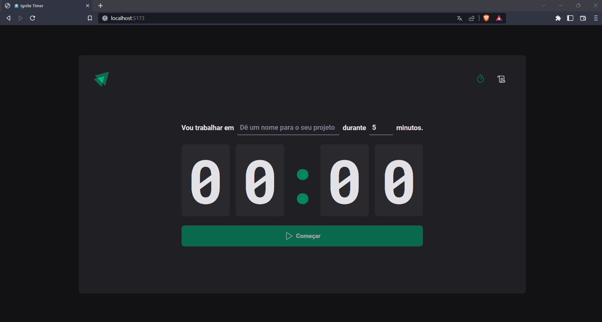
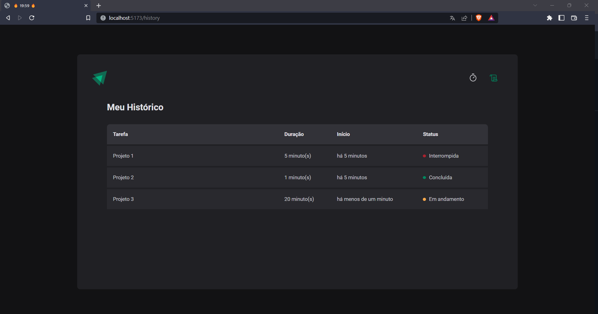

<div id="top" align="center">
  <div>
    
  </div>
  <h4 align="center">⏲️ Ignite Timer - Countdown timer built in React.</h4>
</div>

## Resumo

<ol>
  <li><a href="#visão-geral-do-projeto">Visão geral do projeto</a></li>
  <li><a href="#tecnologias-utilizadas">Tecnologias utilizadas</a></li>
  <li><a href="#instalação-e-utilização">Instalação e utilização</a></li>
  <li><a href="#conhecimentos-aplicados">Conhecimentos aplicados</a></li>
</ol>

## Visão geral do projeto

<div align="center">
  
    
</div>
<div align="center">
  <h3>
    <a target="_blank" href="https://ignite-timer-ponqueli.vercel.app/">Ver projeto no Vercel</a>
  </h3>
</div>

</br>

## Tecnologias utilizadas

- [ReactJS](https://reactjs.org/)
- [React Hook Form](https://react-hook-form.com/)
- [React Router Dom](https://www.npmjs.com/package/react-router-dom)
- [Styled Components](https://styled-components.com/)
- [React-Toastify](https://fkhadra.github.io/react-toastify/introduction)
- [ViteJS](https://vitejs.dev/)
- [Phospor React](https://www.npmjs.com/package/phosphor-react)
- [Yup](https://www.npmjs.com/package/yup)
- [Date-fns](https://date-fns.org/)
- [Zod](https://www.npmjs.com/package/zod)
- [Immer](https://styled-components.com/)
- [Vercel](https://vercel.com/)

## Instalação e utilização

### Pré-requisitos

Instalações necessárias

1. NodeJS
2. Yarn

### Instalação

1. Baixe as depedências do projeto com o comando `$ yarn`.
2. Rode o projeto com o comando `$ yarn dev`. -> localhost:5173

## Conhecimentos aplicados

### Utilizando Layouts do React Router DOM

Essa funcionalidade permite a criação de layout para nossa aplicação. Por exemplo,
imagine que temos um <Header /> que é exibido em diversas páginas do nosso App,
cada vez que uma página é carregada o <Header /> é carregado novamente. Utilizando
os Layouts evitamos isso. Vamos conferir o código abaixo:

<strong>
O componente Outled diz respeito ao local onde o resto da aplicação vai ser inserido, 
como se fosse o children...
</strong>

```js
// criando layout
import { Outlet } from 'react-router-dom'

import { Header } from '../components/Header'

export function DefaultLayout() {
  return (
    <>
      <Header />
      <Outlet />
    </>
  )
}
```

```js
// configurando as rotas para usar o layout
import { Routes, Route, BrowserRouter } from 'react-router-dom'

import { DefaultLayout } from './layouts/DefaultLayout'
import { Home } from './pages/Home'
import { History } from './pages/History'

export function Router() {
  return (
    <BrowserRouter>
      <Routes>
        <Route path="/" element={<DefaultLayout />}>
          <Route path="/" element={<Home />} />
          <Route path="/history" element={<History />} />
        </Route>
      </Routes>
    </BrowserRouter>
  )
}
```

### Reaproveitando estilização de componentes no styled-components

```js
const BaseInput = styled.input``

export const TaskInput = styled(BaseInput)``
```

### Tipando elemento através da chave de outro elemento

```js
const STATUS_COLOR = {
  green: 'green-500',
  yellow: 'yellow-500',
  red: 'red-500'
} as const //Indicando que os valores não são uma simples string

interface TaskStatusProps {
  statusColor: keyof typeof STATUS_COLOR
}

export const TaskStatus = styled.span<TaskStatusProps>`
  background: ${({ theme, statusColor }) => theme[STATUS_COLOR[statusColor]]};
`
```

### Inferência de tipos de um formulário através do ZOD

```js
const newCycleSchemaValidation = zod.object({
  task: zod.string().min(1)    
})

type NewCycleFormData = zod.infer<typeof newCycleSchemaValidation>

const { handleSubmit } = useForm<NewCycleFormData>({
  resolver: zodResolver(newCycleSchemaValidation),
  defaultValues: {
    task: '',
    minutesAmount: 0
  }
})

function handleCreateNewCycle(data: NewCycleFormData) {
  console.log(data)
}
```

### Versionando LocalStorage

A prática de versionar o localStorage é usada para evitar bugs futuros na aplicação. 
Imagine que atualmente os dados são salvos de uma forma e, futuramente esse formato 
é alterado. Ao tentar ler os dados que já estavam no localStorage do usuário a aplicação vai bugar.

```js
const localStorageKey = '@ignite-timer:cycles-state:v1.0'
```

### Utilizando contextos do React

Utilizar contextos no React permite com que posssamos acessar valores de uma forma 
global entre todas as rotas da nossa aplicação.Para isso precisamos criar um provider 
no nível mais alto do nosso app, encapsulando todo o resto.

```js
  <CyclesContextProvider>
    <Rotas />
  </CyclesContextProvider>
```

Agora dentro da rota desejada basta chamar o método useCyclesContext para ter 
acesso a todos os valores enviados pelo provider.

### Utilizando Reducers no React

useReducers são utilizados para armazenar estado, como o hook useState. A principal 
diferenca entre os dois, é que os reducers tem a capacidade de armarzer uma estrutura de 
dados mais complexa de maneira mais fácil. O retorno da função useReducer é o estado 
e um método dispatch, usado para disparar uma action. O useReducer também espera 
receber três parâmetros. O primeiro deles é a própria função que vai tratar as 
actions recebidas do dispatch e alterar o estado; O segudo parâmetro são os valores 
inciais; Já o terceiro parâmetro é uma função responsável por carregar dados de fontes
externas como o localStorage, sendo esse parâmetro, opcional.

```js
 const [cyclesState, dispatch] = useReducer(
    cyclesReducer,
    {
      cycles: [],
      activeCycleID: null
    },
    //nunca pode retornar valor undefined
    loadDataFromLocalStorage
  )
```

### Separando Actions e Reducers utilizando pattern

Para padronizar as nomenclaturas das Actions, pode ser criado um ENUM exportando-o 
para os arquivos que vão utiliza-lo.

```js
export enum ActionTypes {
  ADD_NEW_CYCLE = 'ADD_NEW_CYCLE', 
}
```

Para padrozinar os argumentos enviados através do dispatch, podem ser criadas 
funções, que esperam esses argumentos de forma padronizada e, retornam uma action para o dispatch.

```js
export function addNewCycleAction(newCycle: Cycle) {
  return {
    type: ActionTypes.ADD_NEW_CYCLE,
    payload: {
      newCycle
    }
  }
}

//utilizando método no dispatch
 function createNewCycle({ task, minutesAmount }: CreateCycleData) {
    const newCycle = {
      id: uuidv4(),
      task,
      minutesAmount,
      startDate: new Date()
    }

    dispatch(addNewCycleAction(newCycle))
  }
```

Para separar e padronizar as actions que manipulam o estado dentro do reducer, 
pode ser criado um arquivo separado seguindo o padão abaixo:

```js 
export function cyclesReducer(state: CycleStateReducer, action: any) {
  switch (action.type) {
    case ActionTypes.ADD_NEW_CYCLE:
      return produce(state, (draft) => {
        draft.cycles.push(action.payload.newCycle)
        draft.activeCycleID = action.payload.newCycle.id
      })
    default:
      return state
  }
```

### Immer para manipulações complexas de estado

Obecendo o conceito de imutabilidade do React, algumas operações podem se tornar
confusas, pensando nisso podemos instalar o Immer em nossa aplicação. O Immer 
cria um rascunho do estado onde podemos manipular os dados da forma convêncional, 
depois ele repassa esses dados do rascunho para o estado obedecendo as regras de 
imutabilidade.

```js 
//com immer
case ActionTypes.INTERRUPT_CURRENT_CYCLE: {
  const currentCycleIndex = state.cycles.findIndex(
    (cycle) => cycle.id === state.activeCycleID
  )

  if (currentCycleIndex < 0) return state

  return produce(state, (draft) => {
    draft.cycles[currentCycleIndex].interruptedDate = new Date()
    draft.activeCycleID = null
  })
}

//sem immer
 case 'INTERRUPT_CURRENT_CYCLE':
  return {
    cycles: state.cycles.map((currentCycle) => {
      if (currentCycle.id === state.activeCycleID) {
        return {
          ...currentCycle,
          interruptedDate: new Date()
        }
      } else {
        return currentCycle
      }
    }),
    activeCycleID: null
  }
```

</br>

<h4 align="center"><a href="#top">Voltar ao Início</a></h4>